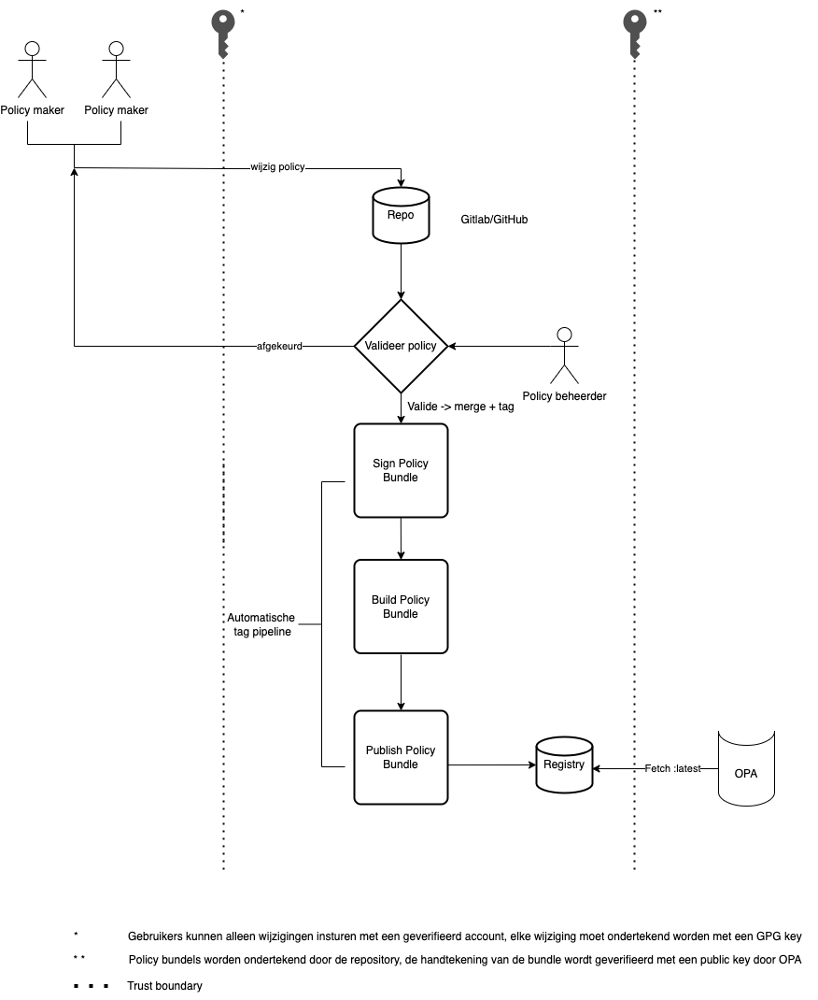

> [!CAUTION]
> DIT IS EEN OFFLINE COPY VAN DE POLICIES BIJ VECOZO ZODAT ER INZICHT GEKREGEN KAN WORDEN IN DE POLICIES  
> DE REPO ONTVANGT GEEN REGELMATIGE UPDATES
> 
> DIT IS DE SITUATIE VAN 20-03-2026
> 

#  Policies

Deze repository bevat alle autorisatiepolicies die binnen de iWlz-keten worden gebruikt. Deze policies, geschreven in Rego, stellen Open Policy Agent (OPA) in staat om te beslissen of een cliënt toegang heeft tot de aangevraagde resources.

# Bewaking van de Policy-Integriteit met Open Policy Agent (OPA)

## Inleiding
OPA draait binnen nID en is daardoor onderdeel van de iWlz keten. Omdat het beheren van de autorisatie policies losstaat van het uitvoeren van de autorisatie, is er gekozen om de policies te beheren in een aparte repository. De policies kunnen hierdoor los van nID aangepast worden en beschikken over hun eigen change lifecycle.

Het splitsen van de policies en de implementatie en het uit handen geven van het beheren van de policies aan derden brengt integriteitsrisico's met zich mee. Hieronder wordt kort opgesomd waarom het belangrijk is om dit te mitigeren daarna wordt in detail uitgelegd welke risico's er zijn en hoe deze gemitigeerd worden. 

- **Beveiliging**: Het ondertekenen van policies voorkomt manipulatie en waarborgt hun veiligheid.
- **Vertrouwen**: Digitale handtekeningen bieden eindgebruikers de zekerheid dat de policies afkomstig zijn van een betrouwbare bron.
- **Compliance**: In veel omgevingen is het handhaven van strikte beveiligingsprotocollen en compliance-normen essentieel.
- **Automatisering en Efficiëntie**: Automatische ondertekening stroomlijnt workflows en vermindert menselijke fouten.

## Using OPA instead of cosign/policy

<!-- Deze documentatie biedt een uitgebreid overzicht van het bundle signing proces binnen Open Policy Agent (OPA). Het richt zich op de stappen, componenten, en beveiligingsprotocollen betrokken bij het waarborgen van de integriteit en authenticiteit van OPA-policy bundels. -->

## Vertrouwensgrenzen (Trust Boundaries)
Binnen dit systeem zijn er twee belangrijke vertrouwensgrenzen:
 - Het aanpassen van policies door derden overschrijdt een vertrouwensgrens.
 - Het ophalen van policies door OPA uit de repository overschrijdt een vertrouwensgrens.

Bij het overschrijden van een trust boundary bestaat er een risico dat de inhoud van de policies gecompromitteerd raakt daardoor is het belangrijk deze risico's te mitigeren.

## Risico's en Maatregelen
### Aanpassen van Policies door Derden

Het wijzigen van de policies kan worden uitbesteed aan de beheerder van de resource servers (derde). Om dit zo makkelijk mogelijk te maken is er gekozen voor het gebruik van een Git repository op Gitlab. Derde kunnen hierin zelf hun policies beheren, elk verzoek tot het wijzigen of toevoegen van een policy zal gecontroleerd moeten worden door een admin van deze repository. Derde hebben dus geen rechten om direct hun wijzigingen door te voeren. 

Bij het doorvoeren van wijzigingen door derde worden policies vanaf de omgeving van deze persoon verstuurd naar de online Gitlab omgeving, hierbij wordt een trust boundary overschreden en bestaat er dus een beveiligings risico.

De volgende twee risico's zijn geïdentificeerd:

**Toegang door ongeautoriseerde accounts**  
Om dit te voorkomen wordt de repository zo ingericht dat enkel geautoriseerde accounts toegang rechten hebben om wijzigingen uit te voeren. 

**Mutaties uitvoeren onder de naam van een andere geautoriseerde gebruiker**  
Voor auditability is het belangrijk dat bekend is wie welke mutaties doorvoert aan een policy, hiervoor is het dus belangrijk dat men enkel onder hun eigen naam wijzigingen kan doorvoeren. Om dit te kunnen garanderen wordt men verplicht om een GPG key te gebruiken, met de GPG key wordt elke mutatie cryptografisch ondertekend.

### Synchroniseren van bundels tussen de repository en OPA
De OPA service zal periodiek moeten synchroniseren met de policy repository, hierbij wordt ook een trust boundary overschreden. Het is dus belangrijk dat dat de OPA service kan "vertrouwen" dat de policies die hij binnen haalt afkomstig zijn van de juiste bron zonder dat deze tussentijds zijn aangepast. 

Om dit te kunnen garanderen maken wij gebruik van "bundle signing". Hiermee kan de OPA service cryptografisch controleren of de policies verpakt in een bundel afkomstig zijn van de repository en dat er niet geknoeid is met de inhoud. 

Dit proces zit als volgt in elkaar: bij mutaties van policies kan de beheerder van de repository ervoor kiezen om een nieuwe bundel aan te maken. In deze bundle zitten alle laatste versies van de verschillende policies. De gemaakte bundle wordt binnen de repository ondertekend met een Private key. De OPA service haalt de nieuwste versie van de bundle op en checkt of de handtekening afkomstig is van de Gitlab repository, dit doet de OPA service met behulp van de Public key van de repository. 

---
